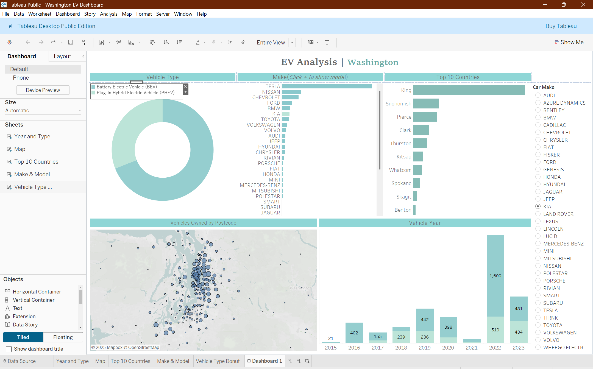

# 🚗 Electric Vehicle Sales Analysis Dashboard

## 📌 Project Overview  
This project focuses on analyzing **Electric Vehicle (EV) sales data** to uncover market trends, manufacturer performance, and geographical distribution.  
The interactive dashboard built in **Tableau** and **Excel** provides insights into sales growth, vehicle types, and adoption patterns across regions.

---

## 🔍 Key Features  
✅ **Sales by Region & Manufacturer** – Understand how EV sales vary by location and top-performing brands.  
✅ **Vehicle Type Trends** – Track the popularity of BEVs (Battery Electric Vehicles) vs. PHEVs (Plug-in Hybrid Electric Vehicles).  
✅ **Interactive Filters** – Slice the data by year, manufacturer, or vehicle type for detailed insights.  

---

## 🛠 Tools & Technologies Used  
- **Excel** – Data cleaning, preprocessing & aggregation.  
- **Tableau** – Dashboard creation & visualization.  

---

## 📊 Insights Gained  
📈 Steady YoY growth in EV adoption across regions.  
🏆 Certain manufacturers dominate the EV market share.  
🌍 Sales hotspots identified through geographic mapping.  

---

## 📊 Dasbhoard

 

---
